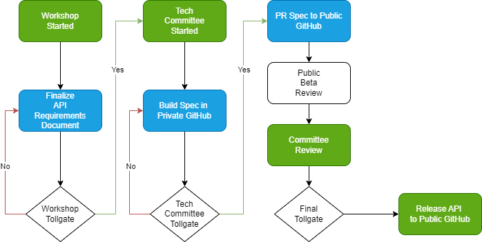

# Governance (WIP)

This governance documentation outlines the structure, roles, and processes that guide the management and decision-making within our project. Effective governance ensures that the project is managed transparently, efficiently, and in alignment with our goals and values. This document provides a clear framework for the roles involved and the tollgates that must be passed to ensure quality and consistency.

## Roles

### Board Member

Responsible for overseeing the strategic direction and overall governance of the project. Board members ensure that the project aligns with its mission and long-term goals. They are also responsible as a toll gate for updating the resource.

### Product Manager

Focuses on defining the product vision, strategy, and roadmap. The Product Manager works closely with stakeholders to prioritize features and ensure that the product meets user needs and business objectives. Product managers will be responsible for a specific API to lead.

### Tech Lead

Provides technical leadership and guidance to the development team. The Tech Lead ensures that the technical aspects of the project are aligned with the overall strategy and that best practices are followed.

## Tollgates

Tollgates are critical checkpoints in the project lifecycle that must be passed to proceed to the next phase. These tollgates ensure that the project maintains high standards of quality and that all necessary criteria are met before moving forward. Each tollgate involves a review process where key stakeholders assess the project's progress and make decisions on whether to advance to the next stage.

By clearly defining roles and tollgates, this governance documentation aims to create a structured and transparent environment that fosters collaboration, accountability, and continuous improvement.

### Definitions

#### Workshop

A workshop consists of the Product Manager leads and contributors for a specific API meeting up to create the following artifacts:

- Requirements Documentation
- User Stories
- Diagrams

Once the workshop artifacts are created and the workshop tollgate has been passed, the artifacts are passed to the tech committee.

#### Tech Committee

The tech committee consists of the leads and contributes who are the Tech Leads within the companies for a specific API. They meet up and take the results of the workshop and ultimately create the API Specification. The specification will include the artifacts created from the workshop.

After the tech committee tollgate has been passed, it moves to public beta review and committee review.

### Tollgate Diagram

